# Ravn Frontend Challenge — Task Management

A responsive task-management application built with React, TypeScript and GraphQL. It supports task browsing, search and filters, task CRUD operations, an authenticated-user view, and platform-aware layouts for desktop, Android and iOS.

## Highlights

- Dashboard with five task-status columns: Backlog, To Do, In Progress, Done and Cancelled.
- Board and list presentations, switchable from the task toolbar.
- Task counts in every board column and in each list category.
- Search with debounce and combinable filters for status, estimate, labels, due date and assignee.
- Create, edit and delete tasks against the GraphQL API.
- Apollo Client normalized cache with intentional update strategies for create, update and delete.
- My Tasks view, scoped to the authenticated user.
- Settings page with authenticated-user information.
- Responsive desktop, Android and iOS-oriented UI compositions.
- Due-date feedback: green for future dates, yellow for today/tomorrow, and red for overdue tasks in the list view; overdue dates are highlighted on board cards.
- Accessible dialogs, menus, focus management and keyboard-friendly controls.

## Screenshots

### Dashboard

#### Desktop

<p align="center">
  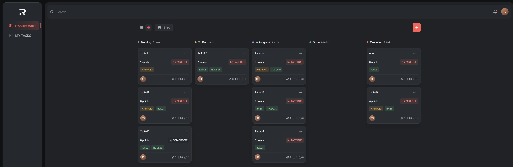
</p>

#### iOS

<p align="center">
  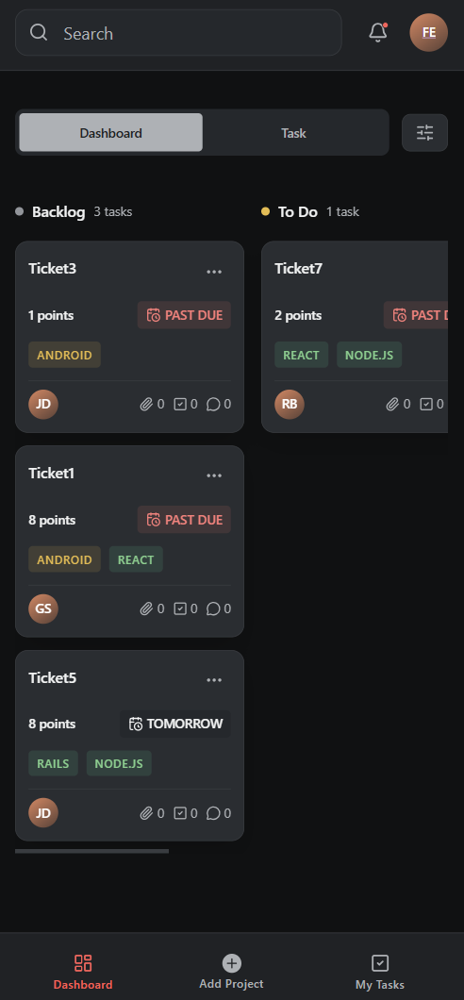
</p>

#### Android

<p align="center">
  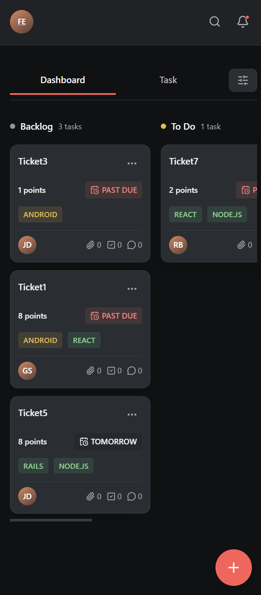
</p>

### Create task

#### Desktop

<p align="center">
  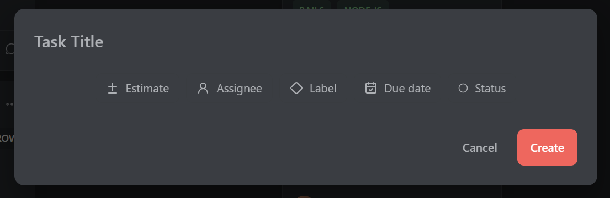
</p>

#### Mobile

<p align="center">
  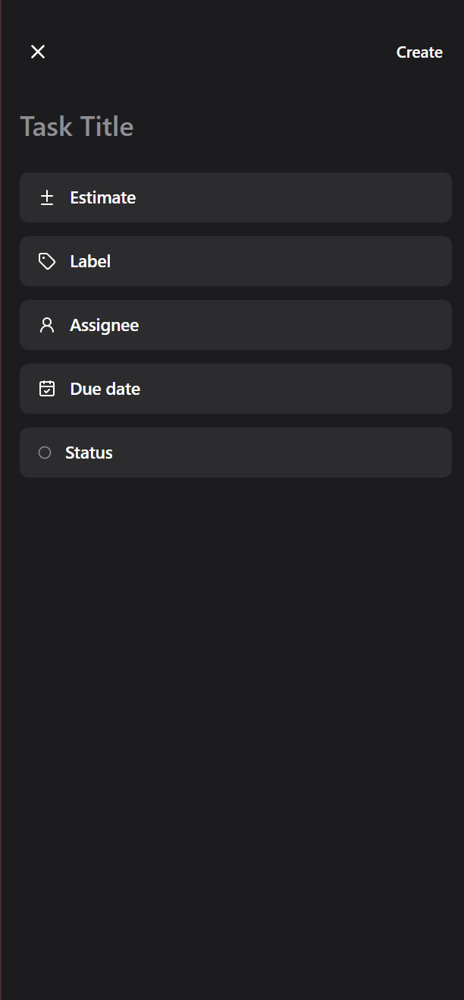
</p>

### Edit task

#### Desktop

<p align="center">
  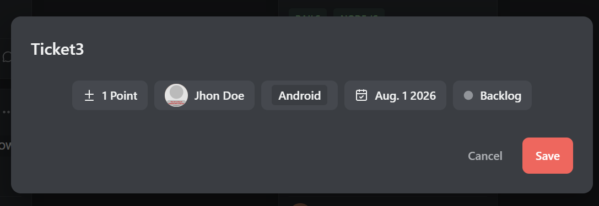
</p>

#### Mobile

<p align="center">
  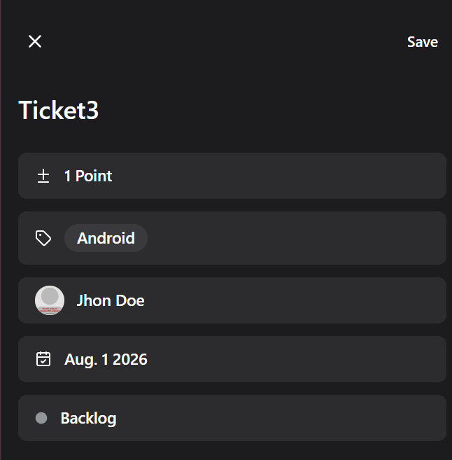
</p>

### My Tasks

#### Desktop

<p align="center">
  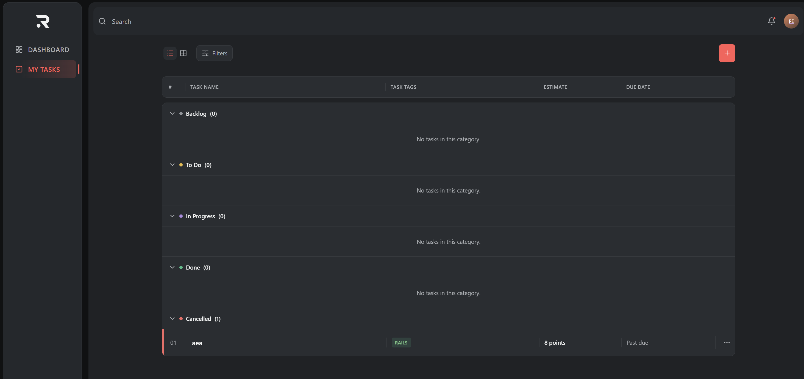
</p>

#### iOS

<p align="center">
  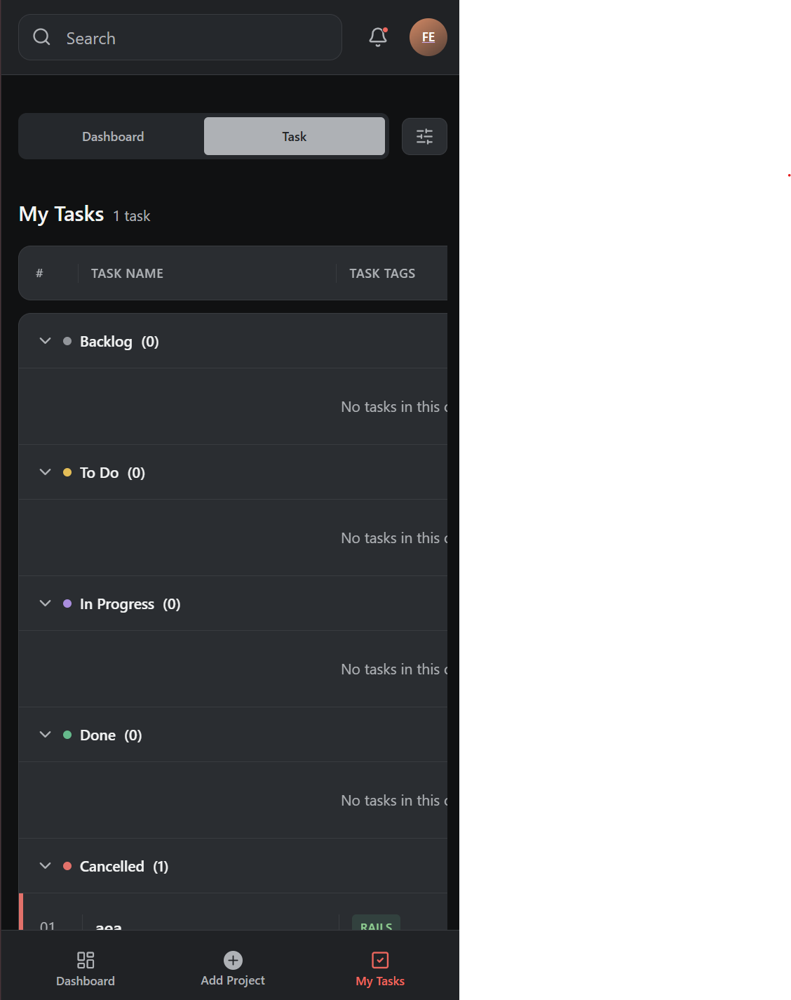
</p>

#### Android

<p align="center">
  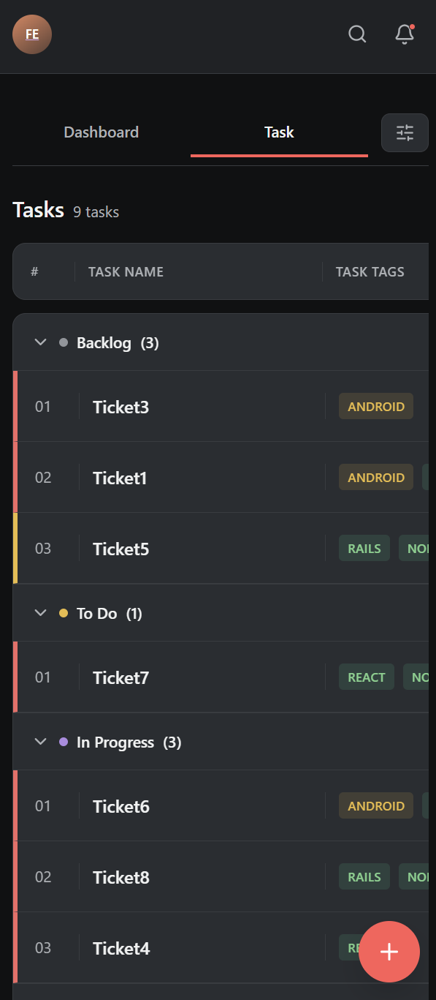
</p>

### Settings

#### Desktop

<p align="center">
  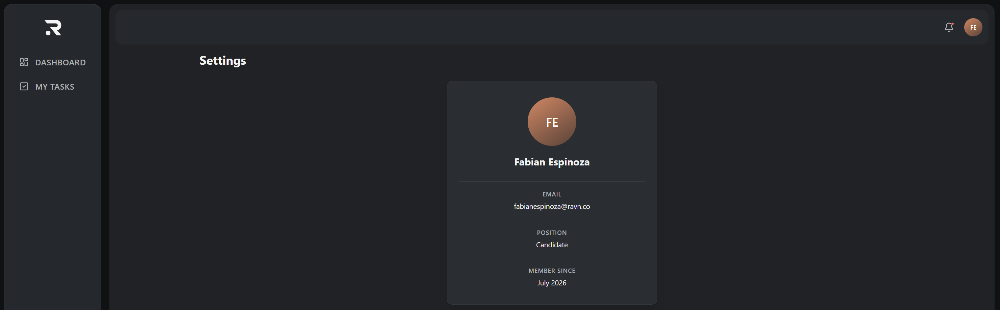
</p>

#### Mobile

<p align="center">
  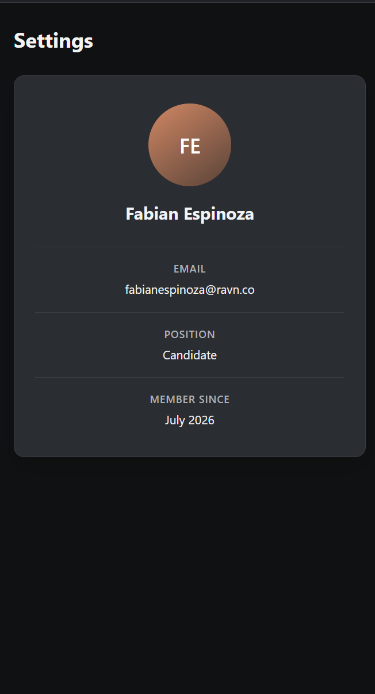
</p>

## Bonus features implemented

| Bonus                              | Implementation                                                                                                           |
| ---------------------------------- | ------------------------------------------------------------------------------------------------------------------------ |
| Total count of tasks by column     | Every board column computes and displays its number of tasks.                                                            |
| Change layout from columns to list | The toolbar switches between `TaskBoard` and `TaskList` without re-fetching data.                                        |
| Date color by deadline             | Task date state is derived from the local calendar day: future (`green`), today/tomorrow (`yellow`) and overdue (`red`). |

Drag and drop between columns and entry animations for newly created tasks are not included.

## Tech stack

- React 19 and TypeScript
- Vite
- React Router 7
- Apollo Client 4 and GraphQL
- CSS Modules with global design tokens
- Lucide icons
- Vitest and React Testing Library
- ESLint and Prettier
- GitHub Actions

## Architecture

The repository follows a lightweight feature-sliced structure:

| Folder         | Responsibility                                                                |
| -------------- | ----------------------------------------------------------------------------- |
| `src/app`      | Application providers, routing, layout and global styles.                     |
| `src/pages`    | Route-level pages: Dashboard, My Tasks and Settings.                          |
| `src/widgets`  | Composed interface sections such as sidebar, header, toolbar, board and list. |
| `src/features` | User workflows: task form, task actions and filters.                          |
| `src/entities` | Task and user models, GraphQL operations and entity UI.                       |
| `src/shared`   | Reusable UI primitives, configuration, API client and utilities.              |
| `src/test`     | Shared testing utilities and GraphQL mocks.                                   |

`AppLayout` coordinates shared UI state: navigation, filters, task creation/editing, delete confirmation and the responsive form container. Apollo owns remote data and its normalized cache.

## Data flow

```text
Dashboard / My Tasks
  → page data hook
  → Apollo useQuery(GET_TASKS)
  → GraphQL API
  → InMemoryCache
  → API-to-UI mapper
  → TaskBoard or TaskList
```

Task mutations are handled as follows:

- Create: runs `CREATE_TASK` and refetches active `GET_TASKS` queries so server-side filters remain authoritative.
- Update: `UPDATE_TASK` returns the full task; Apollo updates the normalized entity automatically. A reassignment also refetches task lists because it can change My Tasks membership.
- Delete: `DELETE_TASK` evicts the task entity from Apollo cache and runs garbage collection, removing it from cached lists without a full refetch.

## Responsive behavior

The shared layout breakpoint is `768px`.

- Desktop: persistent sidebar, full header and task form modal.
- Android narrow viewport: drawer navigation, compact header, floating create button and Material-style date picker.
- iOS/other narrow viewport: bottom navigation, full-page task form and wheel-style date picker.

The form draft is owned by `AppLayout`, so entered values survive a switch between desktop modal and mobile full-page containers.

## Prerequisites

- Node.js `>=22 <25`
- npm `>=10`

## Getting started

1. Install dependencies:

   ```bash
   npm install
   ```

2. Create your local environment file:

   ```powershell
   Copy-Item .env.example .env.local
   ```

3. Set the GraphQL credentials in `.env.local`:

   ```env
   VITE_GRAPHQL_ENDPOINT=...
   VITE_GRAPHQL_TOKEN=...
   ```

4. Start the development server:

   ```bash
   npm run dev
   ```

The app is normally available at `http://localhost:5173`.

## Scripts

| Command                 | Purpose                                    |
| ----------------------- | ------------------------------------------ |
| `npm run dev`           | Start the development server.              |
| `npm run build`         | Type-check and create a production build.  |
| `npm run preview`       | Serve the production build locally.        |
| `npm run typecheck`     | Check TypeScript without building.         |
| `npm run lint`          | Run ESLint.                                |
| `npm run format:check`  | Verify Prettier formatting.                |
| `npm run test`          | Run the test suite.                        |
| `npm run test:coverage` | Run tests and generate coverage artifacts. |

## Quality and security

The project uses strict TypeScript, ESLint, Prettier, Vitest and React Testing Library. GitHub Actions verifies formatting, types, linting, tests and production build on pushes and pull requests.

Environment files and credentials are ignored by Git. Never commit `.env.local` or access tokens; use `.env.example` as the configuration template.
